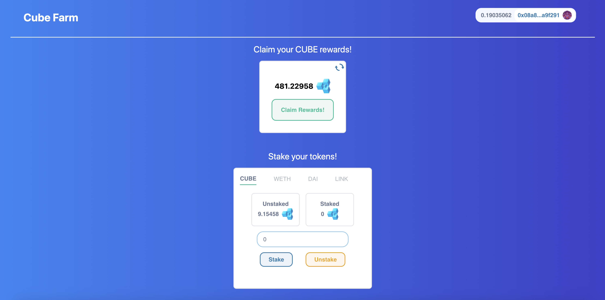

# Cube Farm frontend



This is a repository to give a user interface on the Cube Farm contracts.
This repository is the frontend repository of the [Cube Farm contracts](https://github.com/jrchain/defi-cube-yield-farm). However you absolutly can use this repository without the backend part.

[Full example of the App here!](https://lucky-union-0544.on.fleek.co/)

## Summary

This repository works with 2 mains contracts:

- The Cube Token : A ERC20 token with the specificity that only the address with Minter role can mint the token.
- The Cube Farm : The yield farming defi contract.

The Cube Farm allow you to :

- `stakeTokens`: Add any approved token to the Cube Farm contract for yiel farming.
- `UnstakeTokens`: Remove your tokens from the Cube Farm contract.
- `clainYieldRewards`: Get rewarded with CUBE tokens calculated with a giving rate and the Chainlink price feed. The rate represents the time in seconds to be rewarded by 100% of the total amount staked. For example if the rate is 86400 seconds (1 day) and the amount staked is 1 ether, then the reward will be 1 ether (in CUBE) after 1 day of staking.
- `getTotalPendingRewards`: Get the total pending CUBE rewards the user can claim.

- [Cube Farm](#cube-farm)
  - [Summary](#summary)
  - [Prerequisites](#prerequisites)
  - [Installation](#installation)
  - [Testing](#testing)

## Prerequisites

Please install or have installed the following:

- [git](https://git-scm.com/book/en/v2/Getting-Started-Installing-Git)
- [nodejs](https://nodejs.org/en/download/)
- [yarn](https://yarnpkg.com/getting-started/install) instead of `npm`

## Installation

1. Clone this repository

```
git clone https://github.com/jrchain/defi-cube-yield-farm-front-end
cd defi-cube-yield-farm-front-end
```

2. Install dependencies and run the code

```
yarn
yarn dev
```

## Testing

The Application only support goerli network from now. Be sure to connect with goerli network on your metamask.

You'll also need testnet goerli LINK, DAI and WETH if you want to fully use the application.

You can get ETH into your wallet by using the [alchemy goerli faucet](https://goerlifaucet.com/).

You can get ETH and LINK by using the [chainlink faucet](https://faucets.chain.link/).

DAI is actually mapped on the FAU token, you can get some FAU by using this [ERC20 faucet](https://erc20faucet.com/) on the goerli network.

Finnally if you want some WETH you can either use my script get_weth.py located in the [backend repository](https://github.com/jrchain/defi-cube-yield-farm) or use a service like [Uniswap](https://app.uniswap.org/).
